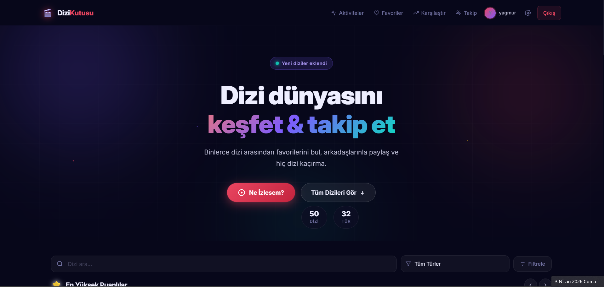
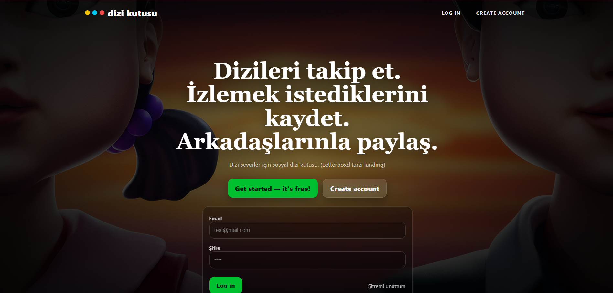
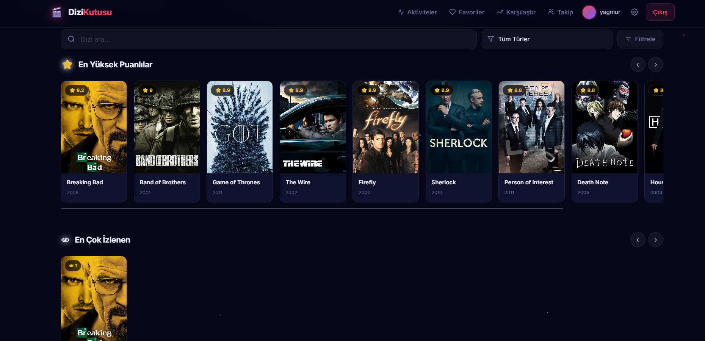
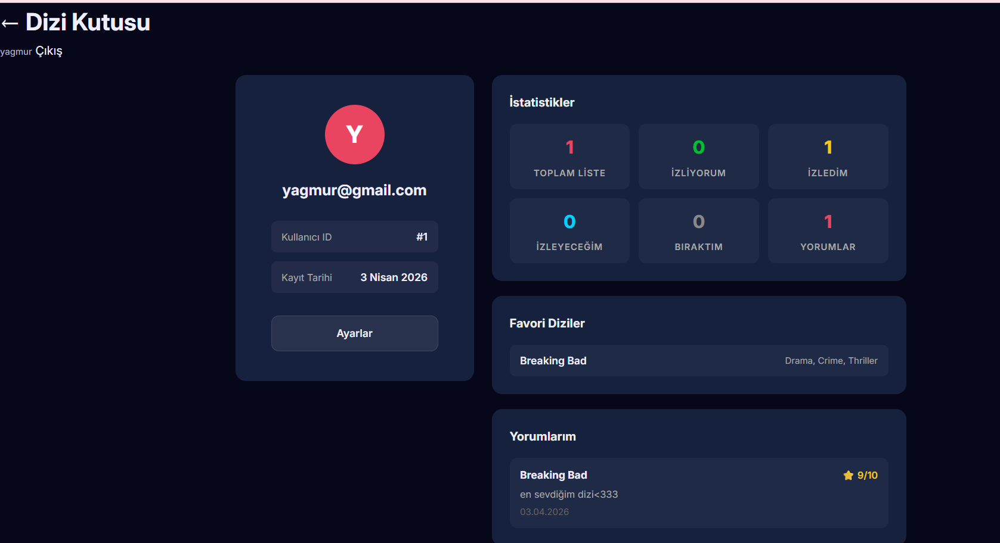
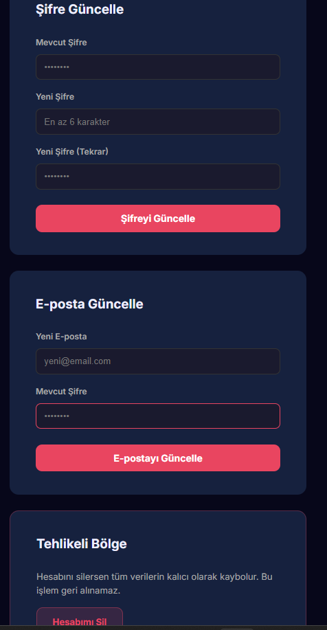

<div align="center">

# 🎬 Dizi Kutusu

### Dizi dünyasını keşfet, takip et, paylaş.

[](https://python.org)
[](https://flask.palletsprojects.com)
[](https://sqlite.org)
[](LICENSE)

<p align="center">
  <b>Dizi severler için sosyal bir platform.</b><br>
  Binlerce dizi arasından favorilerini bul, izlediklerini puanla,<br>
  arkadaşlarınla paylaş ve hiç dizi kaçırma.
</p>

<br>

<!-- Ana ekran görüntüsü buraya -->
<!--  -->

</div>

---

## ✨ Özellikler

<table>
<tr>
<td width="50%">

### 🔐 Kullanıcı Sistemi
- Kayıt ol, giriş yap, şifre sıfırla
- Profil yönetimi & kullanıcı adı belirleme
- Admin paneli ile kullanıcı yönetimi

### 📺 Dizi Keşfi
- Binlerce dizi arasında arama ve filtreleme
- Türe, yıla, puana ve duruma göre gelişmiş filtreler
- "Ne İzlesem?" ile rastgele dizi önerileri
- En yüksek puanlı, en çok izlenen dizi listeleri

</td>
<td width="50%">

### ⭐ Puanlama & Yorumlar
- 10 üzerinden yıldız puanlama sistemi
- Dizi yorumları yazma, düzenleme, silme
- Site ortalaması puanı hesaplama

### 👥 Sosyal Özellikler
- Arkadaş ekleme / takip sistemi
- Arkadaş profillerini görüntüleme
- Aktivite akışı (feed)
- Dizi karşılaştırma aracı

</td>
</tr>
</table>

### 📋 Ek Özellikler

| Özellik | Açıklama |
|---------|----------|
| 📝 Watchlist | İzliyorum, İzledim, İzleyeceğim, Bıraktım durumlarıyla liste yönetimi |
| ❤️ Favoriler | Favori dizileri kaydetme ve listeleme |
| 📊 İstatistikler | Dizi bazlı ve kullanıcı bazlı detaylı istatistikler |
| 🛡️ Admin Paneli | Kullanıcı ve dizi yönetimi, site istatistikleri |
| 🎲 Rastgele Öneri | Türe göre filtrelenebilir rastgele dizi önerisi |
| 📱 Responsive | Mobil ve masaüstü uyumlu modern tasarım |

---

## 📸 Ekran Görüntüleri

<div align="center">


*🏠 Ana Sayfa — Dizi keşfet ve filtrele*

</div>

<details>
<summary><b>📷 Daha fazla ekran görüntüsü görmek için tıklayın</b></summary>
<br>

| Giriş Sayfası | Dizi Detay |
|:-:|:-:|
|  |  |
| *Giriş & Kayıt ekranı* | *Dizi detay sayfası* |

| Profil | Ayarlar |
|:-:|:-:|
|  |  |
| *Kullanıcı profili* | *Hesap ayarları* |

</details>

---

## 🚀 Kurulum

### Gereksinimler

- **Python 3.10+**
- **pip** (Python paket yöneticisi)

### 1️⃣ Depoyu Klonlayın

```bash
git clone https://github.com/mertdonmez1453/dizi-kutusu.git
cd dizi-kutusu
```

### 2️⃣ Sanal Ortam Oluşturun

<details>
<summary><b>🪟 Windows</b></summary>

```bash
python -m venv .venv
.venv\Scripts\activate
```
</details>

<details>
<summary><b>🍎 macOS / 🐧 Linux</b></summary>

```bash
python3 -m venv .venv
source .venv/bin/activate
```
</details>

### 3️⃣ Bağımlılıkları Yükleyin

```bash
pip install -r requirements.txt
```

### 4️⃣ Uygulamayı Başlatın

```bash
python run.py
```

> 🟢 Uygulama `http://127.0.0.1:5000` adresinde çalışmaya başlar.  
> 📦 Veritabanı ve tablolar ilk çalıştırmada otomatik oluşturulur.

### 5️⃣ Dizi Verilerini Yükleyin *(Opsiyonel)*

TVMaze API'den örnek dizi verileri çekmek için:

```bash
python -m app.scripts.seed_series --pages 5
```

> `--pages` parametresi kaç sayfa veri çekileceğini belirler (her sayfa ~250 dizi).

> ⚠️ **Not:** Hata alırsanız `instance/app.db` dosyasını silip uygulamayı yeniden başlatın, ardından seed komutunu tekrar çalıştırın.

---

## 🛡️ Admin Paneli

Admin yetkisi vermek ve almak için Flask CLI komutlarını kullanabilirsiniz:

```bash
# Admin yetkisi ver
flask set-admin kullanici@mail.com

# Admin yetkisini kaldır
flask remove-admin kullanici@mail.com
```

> Admin paneline `/admin` adresinden erişebilirsiniz. Yalnızca admin yetkisine sahip kullanıcılar erişebilir.

---

## 🧪 Test

Testleri çalıştırmak için:

```bash
pytest
```

Test dosyaları `tests/` klasöründe yer alır. Testler SQLite in-memory veritabanı kullanır.

---

## 🏗️ Proje Yapısı

```
dizi-kutusu/
├── 📄 run.py                    # Uygulama başlatma noktası
├── 📄 requirements.txt          # Python bağımlılıkları
├── 📁 app/
│   ├── __init__.py              # Flask app factory
│   ├── db.py                    # Veritabanı bağlantısı
│   ├── utils.py                 # Yardımcı fonksiyonlar
│   ├── 📁 models/               # Veritabanı modelleri
│   │   ├── user.py              #   Kullanıcı
│   │   ├── series.py            #   Dizi
│   │   ├── episode.py           #   Bölüm
│   │   ├── review.py            #   Yorum / Puan
│   │   ├── watchlist.py         #   İzleme listesi
│   │   ├── favorite.py          #   Favoriler
│   │   └── friendship.py        #   Arkadaşlık
│   ├── 📁 routes/               # API & sayfa yönlendirmeleri
│   │   ├── auth.py              #   Kimlik doğrulama
│   │   ├── main.py              #   Ana sayfalar
│   │   ├── series.py            #   Dizi API'leri
│   │   ├── profile.py           #   Profil yönetimi
│   │   ├── watchlist.py         #   Watchlist API
│   │   ├── review.py            #   Yorum API
│   │   ├── favorite.py          #   Favori API
│   │   ├── friendship.py        #   Arkadaşlık API
│   │   ├── episode.py           #   Bölüm API
│   │   └── admin.py             #   Admin paneli
│   ├── 📁 templates/            # HTML şablonları
│   │   ├── base.html            #   Temel şablon
│   │   ├── auth/                #   Giriş/Kayıt sayfaları
│   │   ├── profile.html         #   Profil sayfası
│   │   ├── series_detail.html   #   Dizi detay sayfası
│   │   └── ...                  #   Diğer sayfalar
│   ├── 📁 static/
│   │   ├── css/                 #   Stil dosyaları
│   │   └── img/                 #   Görseller
│   └── 📁 scripts/
│       └── seed_series.py       #   Veri yükleme scripti
├── 📁 tests/                    # Test dosyaları
│   ├── conftest.py              #   Test konfigürasyonu
│   └── test_auth.py             #   Auth testleri
└── 📁 instance/
    └── app.db                   # SQLite veritabanı (otomatik oluşur)
```

---

## 🛠️ Teknolojiler

<div align="center">

| Katman | Teknoloji |
|--------|-----------|
| **Backend** | Flask 3.1, Python 3.10+ |
| **Veritabanı** | SQLite + SQLAlchemy ORM |
| **Frontend** | HTML5, CSS3, Vanilla JavaScript |
| **Tasarım** | Glassmorphism, Dark Mode, Responsive |
| **Font** | Google Fonts (Inter) |
| **Test** | pytest |
| **API** | TVMaze (dizi verileri) |

</div>

---

## 👥 Ekip

| İsim | Rol |
|------|-----|
| **Mert Dönmez** | Test & Proje Yönetimi |
| **Şevda Yağmur Asal** | Database|
| **Oğuz Giray Bori** | Backend |
| **Deren Berk**| Frontend|

---

<div align="center">

**Dizi Kutusu** ile dizi dünyasını keşfetmeye başla! 🍿

<sub>Flask ile yapıldı</sub>

</div>
